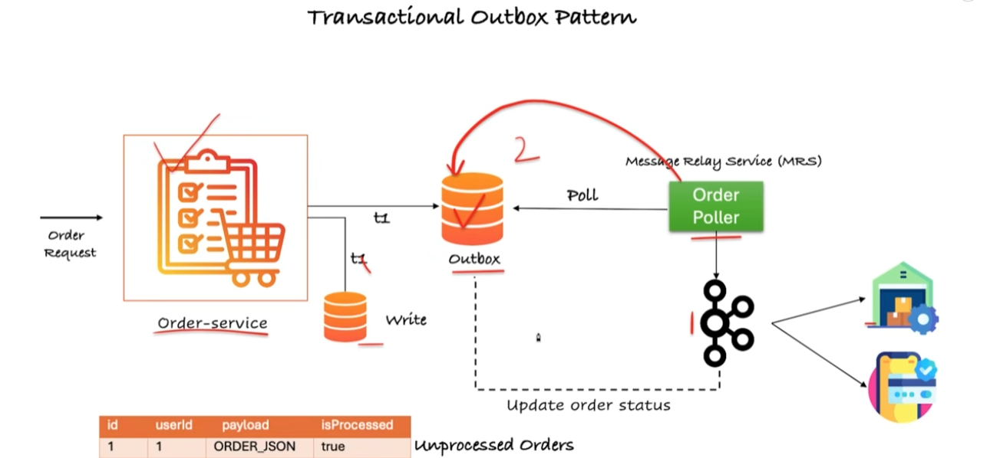

# Microservice Transactional Outbox Pattern - Real-time Hands-On Example

A hands-on example of the **Transactional Outbox Pattern** with microservices and Apache Kafka.

## Why the Outbox Pattern?

When a service must both **update its database** and **publish an event** to a message broker, doing the two separately can fail halfway (the order is saved but the event is lost, or vice versa). The Outbox Pattern solves this:

1. The business data (e.g. the order) and an **outbox event** are written to the database in **one local transaction**.
2. A separate publisher reads unsent events from the outbox table and publishes them to Kafka.
3. Once published, the event is marked as sent.

This guarantees **at-least-once delivery** without distributed transactions, so consumers should be idempotent.

## Architecture



| Component | Responsibility |
|-----------|----------------|
| Order Service (`:9191`) | Exposes `POST /api/orders`, saves the order and outbox event atomically |
| Database | Holds the `orders` and `outbox` tables |
| Outbox Publisher | Scheduled poller that publishes pending outbox events to Kafka |
| Apache Kafka | Message broker (topic `NewTopic`, 3 partitions) |
| Consumer Service | Consumes events from Kafka and processes them |

## Prerequisites

- Java 17+ (or the version used by the project)
- Maven / Gradle
- Apache Kafka (open source, installed locally)

## Running Open Source Kafka Locally

Run these commands from the Kafka installation directory.

1. **Start Zookeeper**
   ```bash
   sh bin/zookeeper-server-start.sh config/zookeeper.properties
   ```
2. **Start the Kafka Server / Broker**
   ```bash
   sh bin/kafka-server-start.sh config/server.properties
   ```
3. **Create the topic**
   ```bash
   sh bin/kafka-topics.sh --bootstrap-server localhost:9092 --create --topic NewTopic --partitions 3 --replication-factor 1
   ```

## Running the Services

Start the Order Service and the consumer service from your IDE or with your build tool, for example:

```bash
mvn spring-boot:run
```

## Try It Out

Create an order through the Order Service:

```bash
curl -X 'POST' \
  'http://localhost:9191/api/orders' \
  -H 'accept: */*' \
  -H 'Content-Type: application/json' \
  -d '{
  "name": "Mobile",
  "customerId": "Basant",
  "productType": "Electronics",
  "quantity": 1,
  "price": 89000
}'
```

Then watch the topic to see the event arrive:

```bash
sh bin/kafka-console-consumer.sh --bootstrap-server localhost:9092 --topic NewTopic --from-beginning
```

## Flow

1. The client calls `POST /api/orders`.
2. The Order Service saves the order and the outbox record in a single transaction.
3. The outbox publisher polls for unsent events.
4. Events are published to the Kafka topic `NewTopic`.
5. The consumer reads and processes the events, and the outbox record is marked as sent.

## Repository Structure

```
.
├── architecture/
│   └── architecture.png
└── README.md
```
